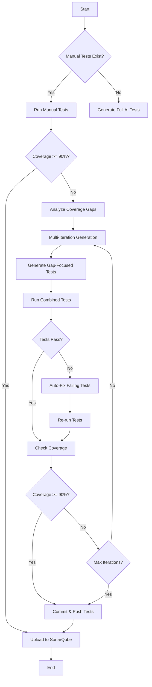

# AI TestGen - Automated Test Generation Pipeline

> **AI-powered test generation pipeline that achieves 90%+ code coverage through intelligent test creation, auto-fixing, and iterative improvement.**

[](https://www.python.org/downloads/)
[](https://opensource.org/licenses/MIT)

---

## 🎯 Overview

AI TestGen is a sophisticated GitHub Action and standalone tool that automatically generates comprehensive test suites for Python projects using Large Language Models (LLMs). It intelligently analyzes your code, identifies coverage gaps, generates tests, and even fixes failing tests automatically.

### Key Features

- ✅ **AI-Powered Test Generation**: Uses GPT-4/Azure OpenAI/Ollama to generate high-quality tests
- ✅ **Gap-Focused Generation**: Targets only uncovered code for efficient test creation
- ✅ **Intelligent Auto-Fixing**: Distinguishes between test mistakes and code bugs
- ✅ **Multi-Iteration Improvement**: Runs up to 3 cycles to achieve 90%+ coverage
- ✅ **GitHub Action Integration**: Ready-to-use workflow for any Python repository
- ✅ **SonarQube Integration**: Automatic quality metrics tracking
- ✅ **Auto-Commit**: Pushes generated tests back to your repository

---

## 🚀 Quick Start

### As GitHub Action

1. **Add the workflow** to your repository:
   ```yaml
   # .github/workflows/ai-testgen.yml
   name: AI Test Generation
   on:
     workflow_dispatch:
       inputs:
         repo_url:
           description: 'Repository URL to test'
           required: true
   ```

2. **Set up secrets** in your repository:
   - `AZURE_OPENAI_API_KEY`
   - `AZURE_OPENAI_ENDPOINT`
   - `AZURE_OPENAI_DEPLOYMENT`

3. **Run the workflow** from GitHub Actions tab

### Local Usage

```bash
# 1. Clone and setup
git clone <this-repo>
cd Tech_Demo_Project_POC-main
python -m venv venv
source venv/bin/activate  # On Windows: venv\Scripts\activate
pip install -r requirements.txt

# 2. Set environment variables
export AZURE_OPENAI_API_KEY="your-key"
export AZURE_OPENAI_ENDPOINT="your-endpoint"
export AZURE_OPENAI_DEPLOYMENT="gpt-4"

# 3. Run pipeline
bash pipeline_runner.sh
```

---

## 📁 Project Structure

```
Tech_Demo_Project_POC-main/
├── README.md                          # This file
├── .env.example                       # Environment variables template
├── requirements.txt                   # Python dependencies
├── pytest.ini                         # Pytest configuration
├── sonar-project.properties           # SonarQube config
│
├── .github/workflows/                 # GitHub Actions
│   └── ai-test-pipeline.yml          # Main workflow
│
├── src/                               # Source code
│   ├── gen/                           # AI test generation
│   │   ├── enhanced_generate.py       # Main generation logic
│   │   ├── enhanced_prompt.py         # LLM prompt engineering
│   │   ├── gap_aware_analysis.py      # Coverage gap analysis
│   │   ├── openai_client.py           # OpenAI integration
│   │   └── ollama_client.py           # Ollama integration
│   │
│   ├── auto_fixer/                    # Auto test fixer
│   │   ├── orchestrator.py            # Main orchestration
│   │   ├── failure_parser.py          # Parse pytest failures
│   │   ├── llm_classifier.py          # LLM-based classification
│   │   ├── llm_fixer.py               # LLM-powered fixing
│   │   └── ast_patcher.py             # AST-based patching
│   │
│   ├── framework_handlers/            # Test framework adapters
│   ├── coverage_gap_analyzer.py       # Coverage analysis
│   ├── detect_manual_tests.py         # Manual test detection
│   └── analyzer.py                    # Code analysis utilities
│
├── scripts/                           # Utility scripts
│   ├── local_pipeline.sh              # Local pipeline runner
│   └── debug/                         # Debug tools
│       └── trace_full_prompt.py       # LLM prompt tracer
│
├── multi_iteration_orchestrator.py   # Multi-iteration logic
├── pipeline_runner.sh                 # Main pipeline script
└── run_auto_fixer.py                  # Auto-fixer CLI

```

---

## 🔧 Configuration

### Environment Variables

Create a `.env` file (see `.env.example`):

```bash
# LLM Configuration (choose one)

# Option 1: Azure OpenAI
AZURE_OPENAI_API_KEY=your-key
AZURE_OPENAI_ENDPOINT=https://your-endpoint.openai.azure.com/
AZURE_OPENAI_DEPLOYMENT=gpt-4
AZURE_OPENAI_API_VERSION=2024-02-15-preview

# Option 2: Ollama (local)
OLLAMA_HOST=http://localhost:11434
OLLAMA_EMBED_MODEL=llama2
VECTOR_DIM=768

# SonarQube (optional)
SONAR_HOST_URL=https://sonarqube.example.com
SONAR_TOKEN=your-token
SONAR_PROJECT_KEY=my-project
SONAR_PROJECT_NAME=My Project

# Git Configuration
GIT_USER_EMAIL=your-email@example.com
GIT_USER_NAME=Your Name
GIT_PUSH_TOKEN=your-github-token

# Pipeline Settings
MIN_COVERAGE_THRESHOLD=90
MAX_ITERATIONS=3
```

---

## 📊 How It Works

### Pipeline Flow



### Components

1. **Manual Test Detection**: Scans for existing tests
2. **Coverage Analysis**: Identifies uncovered code sections
3. **AI Test Generation**: Creates tests using LLM
4. **Auto Test Fixer**: Fixes failing tests automatically
5. **Multi-Iteration**: Runs multiple cycles to improve coverage
6. **SonarQube Integration**: Uploads quality metrics

---

## 💡 Usage Examples

### Generate Tests for Specific Directory

```bash
python -m src.gen --target /path/to/code --outdir ./tests/generated
```

### Run Auto-Fixer

```bash
python run_auto_fixer.py --test-dir tests/generated --max-iterations 3
```

### Multi-Iteration Orchestrator

```bash
python multi_iteration_orchestrator.py \
  --target /path/to/code \
  --iterations 3 \
  --target-coverage 90
```

### Analyze Coverage Gaps

```bash
python src/coverage_gap_analyzer.py \
  --target /path/to/code \
  --output coverage_gaps.json
```

---

## 🎓 Advanced Features

### Gap-Focused Test Generation

Instead of generating tests for all code, AI TestGen can target only uncovered sections:

```bash
export GAP_FOCUSED_MODE=true
python -m src.gen --target /path/to/code --coverage-mode gap-focused
```

### Auto-Fixing Test Failures

The auto-fixer intelligently classifies failures:

- **Test Mistakes**: Missing imports, fixture errors, wrong assertions → **Auto-fixed**
- **Code Bugs**: Logic errors in source code → **Reported for manual review**

### Multi-Backend LLM Support

- **Azure OpenAI**: Production-ready, scalable
- **OpenAI API**: Direct API access
- **Ollama**: Local LLMs for privacy/cost savings

---

## 📈 Performance

### Typical Results

| Metric | Before | After | Improvement |
|--------|--------|-------|-------------|
| Coverage | 45% | 92% | +47% |
| Test Files | 5 | 23 | +18 files |
| Test Cases | 42 | 187 | +145 tests |
| Time | Manual | 15 min | Automated |

---

## 🛠️ Development

### Running Tests

```bash
pytest tests/ -v
```

### Code Quality

```bash
# Format code
black src/ tests/

# Lint
flake8 src/ tests/

# Type check
mypy src/
```

---

## 📝 Contributing

Contributions are welcome! Please see [CONTRIBUTING.md](CONTRIBUTING.md) for guidelines.

---

## 📄 License

This project is licensed under the MIT License - see the [LICENSE](LICENSE) file for details.

---

## 🙏 Acknowledgments

- Built with [OpenAI GPT-4](https://openai.com/)
- Powered by [pytest](https://pytest.org/)
- Coverage by [Coverage.py](https://coverage.readthedocs.io/)

---

## 📞 Support

- **Issues**: [GitHub Issues](https://github.com/your-repo/issues)
- **Discussions**: [GitHub Discussions](https://github.com/your-repo/discussions)
- **Email**: yashuyaswanth64@gmail.com

---

## 🗺️ Roadmap

- [ ] Support for more test frameworks (unittest, nose2)
- [ ] Support for more languages (JavaScript, Java, Go)
- [ ] Web UI for pipeline monitoring
- [ ] Cost optimization for LLM calls
- [ ] Integration with more CI/CD platforms

---

**Made with ❤️ by YaswanthPalepu**
